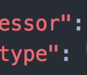

## Table

| Column 1 | Column 2 | Column 3 | Column 4 |
|----------|:---------|:--------:|---------:|
| default  | left     | center   | right    |


*This text will be italic*
**This text will be bold**

a ~~strikethrough~~ element

why don't we take `SuperiorProject` and turn it into `**Reasonable**Project`

1. Item 1
2. Item 2
3. Item 3

* Item
+ Item
- Item

```
x = 0
x = 2 + 2
what is x
```
